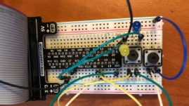
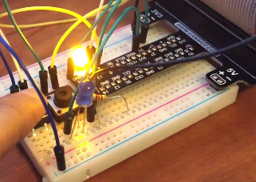
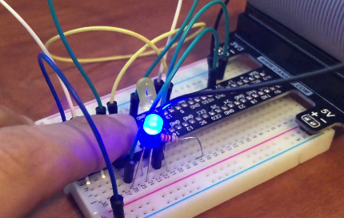
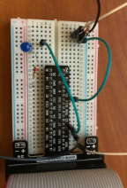

# Goal
The aim of this project was to control the frequency of blinking and brightness of LEDs using user button 
press and to configure temperature sensor to read outside temperature and make the LED glow if it exceeds the threshold. 

# Part 1 
## LED Frequency and Brightness control using switch functionality 
Circuit for part 1

The first LED should begin to blink faster after every second. Once the LED light reaches it fasted frequency of blinking,
it will then begin to go back down to its lowest frequency of blinking. A button should be used to determine when
the LED stops increasing its frequency and when the button is pressed again the LED will then increase its frequency again. 

Once the switch button has been pressed, the functionality shifts to the brightness function.

 
Working : -  This functionality is included in every function.
The GPIO.input(buttonPin2) function detects whether the switch has been pressed or not.
By default, the step2() increasing frequency function is enabled.
When the switch button is pressed for the first time, it calls the brightness function.
In the functions called, the first button does its respective job.

# Part 2
## LED blinks once threshold temperature exceeds
Circuit for part 2

Working : -  When the temperature sensor is detected by raspberry pi, the 28-xxxxxxxxxxxx folder is created in the devices folder.
The w1_slave command retrieves the outside temperature value detected by the sensor and prints it. 
The value is a 5 digit string value that I converted to float value and divided by 1000 to convert to Celsius first and then to Fahrenheit.
I set the threshold temperature to 80 degrees Fahrenheit at which the LED starts glowing.

 
